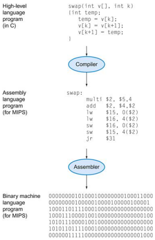

<!--5-1강-->
## 2.1 Introduction
* 인스트럭션(instruction)이란
  * 컴퓨터 하드웨어가 이해하고 따르는 명령을 지칭하는 말이다.
    * 명령을 문자(symbolic)로 표현한 언어가 어셈블리어, 명령을 숫자(binary)로 표현한 언어가 기계어다. 그리고 어셈블리어보다 가독성과 생산성을 높인 C, C++, Java와 같은 언어가 고급 프로그래밍 언어(high-level programming)이다.
    * 그래서 프로그래머가 C 언어로 C 프로그램을 만들면, C 프로그램은 컴파일러에 의해 어셈블리어 프로그램으로 컴파일 되고, 다시 어셈블리어 프로그램은 어셈블러에 의해 기계어 프로그램으로 변환된다.
  * 어셈블리어의 명령어 키워드 하나를 의미하기도 한다.

## 2.2 Operations of the Computer Hardware
* 인스트럭션 집합(Instruction Set) 또는 인스트럭션 집합 구조(Instruction Set Architecture, ISA)란
  * 컴퓨터 언어의 모든 인스트럭션 목록을 말한다.
  * 컴퓨터마다 다른 인스트럭션 집합(Instruction Set)을 가진다.
    * x86, ARM, MIPS 등이 있다.
  * 초기 컴퓨터들은 매우 간단한 인스트럭션 집합을 가졌다.
  * 최신 컴퓨터들도 여전히 간단한 인스트럭션 집합을 포함하고 있다.
* MIPS 인스트럭션 집합(The MIPS Instruction Set)
  * 이 책에서는 MIPS라는 인스트럭션 집합을 예제로 사용한다.
  * 예전부터 많이 사용되어 왔고 현대의 ISA와 매우 흡사하며 그 형태가 간단하기 때문이다.
* 그림 2.2.1
  * 
  * ->
* 간략한 산술 연산 예제를 통해 어떻게 C code가 MIPS 하드웨어가 이해할 수 있는 어셈블리어로 컴파일되는지 알아보자
  * 예제 2.2.1
    * C code:
      * a = b + c;
    * Compiled MIPS code (assembly):
      * add a, b, c
  * 예제 2.2.2
    * C code:
      * a = b + c;
    * Compiled MIPS code (assembly):
      * add a, b, c
  * 예제 2.2.3
    * C code:
      * f = (g + h) - (i + j);
    * Compiled MIPS code (assembly):
      * add $t0, g, h #temp t0 = g + h
      * add $t0, g, h #temp t0 = g + h
      * sub f, t0, t1;
  * MIPS에서 모든 산술 연산은 이러한 형식을 가진다.

## 2.3 Operands of the Computer Hardware
* 레지스터 피연산자(Register Operand)
  * 레지스터란 프로세서에 들어있는 소규모 기억 장치이다. 프로세서에 위치하기 때문에 빠르게 데이터에 접근 가능하다.
  * MIPS는 0번 레지스터부터 31번 레지스터까지 총 32개의 32 비트 레지스터를 가진다. 각 레지스터는 번호와 함께 $t0, $s1와 같은 어셈블러 이름(Assembler names)을 가지고 있다.
    * 이렇듯 MIPS는 기본 단위로 32 비트씩 연산하기 때문에 32 비트 데이터를 워드(word)라는 단위로 나타낸다. 즉 MIPS에서 1 word = 32 bit이다.
* 사실 위에서 본 2.2.1~2.2.3 예제들은 정확한 표현이 아니다. 왜냐하면 산술 인스트럭션은 레지스터 피연산자를 사용하기 때문이다. 따라서 예제 2.2.3을 정확히 고치면 다음과 같다.
  * 예제 2.2.3
    * f, g, h, i, j는 각각 $s0, $s1, $s2, $s3, $s4에 저장되어 있다고 가정하자.
    * C code:
      * f = (g + h) - (i + j);
    * Compiled MIPS code (assembly):
      * add $t0, $s1, $s2
      * add $t0, $s3, $s4
      * sub $s0, $t0, $t1
* 레지스터 피연산자: MIPS 32 레지스터(Register Operands: MIPS 32 Registers)
  * 그림
* 메모리 피연산자(Memory operands)
  * 메인 메모리는 배열, 구조체와 같은 복합적인 데이터를 저장하는 데 사용되는 기억 장치이다. 프로세서 밖에 위치하기 때문에 빠르게 데이터에 접근하는 것이 불가능하다.
  * 산술 연산은 레지스터 피연산자를 사용한다고 했으므로, 메모리에 저장된 데이터들로 산술연산을 하기 위해선 메모리에서 레지스터로 값을 가져와야 한다. 이때 메모리는 byte 단위의 주소(address)로 접근 가능하다.
    * MIPS는 Big Endian 방식을 사용한다. Big Endian이란 MSB(Most-significant byte)를 앞에 적는 방식이다.
* 예제를 통해 어떻게 메모리에 저장된 데이터의 산술 연산을 할 수 있는 지 알아보자
  * 예제 2.3.1
    * C code:
      * A[12] = h + A[8];
    * Compiled MIPS code:
      * lw $t0, 32($s3) # $s3에 저장된 주소값으로 메모리에 접근해서, 그로부터 +32byte 떨어진 곳에 저장된 데이터(1 word 짜리)를 $t0로 가져온다.
      * add $s1, $s2, $t0 # 이로써 메모리에 저장된 데이터 값의 산술 연산을 할 수 있다.
      * sw $t0, 48($s3) # $s3에 저장된 주소값으로 메모리에 접근해서, 그로부터 +48byte 떨어진 곳에 $t0에 저장된 데이터(1 word 짜리)를 저장한다.
* 레지스터(Register) vs. 메인 메모리(Memory)
  * 앞서 언급한 레지스터와 메모리의 특성을 정리하면 다음과 같다.
  * 레지스터는 메모리보다 빠르게 접근 가능하다.
  * 메모리 데이터를 연산하기 위해선 로드(loads)와 스토어(stores) 연산을 필요로 한다.
    * 즉 더 많은 인스트럭션이 실행되어야 한다
  * 결론적으로 컴파일러는 변수의 저장공간으로 가능한 레지스터를 사용해야 한다.
    * 사용 빈도가 낮은 변수의 경우에만 메모리에 저장하는 것이 좋다.
    * 레지스터 최적화는 아주 중요한 이슈이다.
* 메모리 계층(Memory Hierarchy)
  * 레지스터와 메인 메모리말고도 많은 종류의 메모리들이 있다. 밑으로 내려갈수록 용량이 커지고 속도는 느려진다.
    * registers
    * cache
    * main memory
    * solid-state disk
    * hard disk
    * optical disk
    * magnetic tapes
* Immediate 인스트럭션
  * 레지스터, 메모리 피연산자가 아닌 상수값 피연산자로 연산을 하는 인스트럭션도 있다.
  * 예제 2.4.1
    * Compiled MIPS code:
      * addi $s2, $s2, 4
  * 예제 2.4.2
    * Compiled MIPS code:
      * addi $s2, $s2, -1
  * 상수값 빼기 연산은 subi가 아니라 음수를 사용한다.
* MIPS 상수(MIPS Constant)
  * MIPS 0번 레지스터($zero)는 항상 0의 상수값을 저장하고 있다. 이 레지스터는 다른 값으로 덮어씌어질 수 없다.
  * 한 레지스터에서 다른 레지스터로 값을 옮기고 싶을 때 유용하다
    * 예제 2.4.3
      * Compiled MIPS code: # add $t2, $s1, $zero # $s1에 저장된 값을 $t2로 옮길 수 있다.
* MIPS 디자인 원칙 정리(Summary of MIPS Design Principles)
  1. Simplicity favors regularity
  2. Smaller is faster
  3. Make the common case fast

## 2.4 Signed and Unsigned Numbers
* Unsigned binary integers
* 2s-Complement Sigend Integers
* Signed Negation
* Sign Extension
* MIPS-32 ISA
  * 인스트럭션 종류(Instruction categories)
    * Computational
    * Load/Store
    * Jump and Branch
    * Floating point
    * Memory Management
    * Special
  * 인스트럭션 형식(Instruction Formats)
    * MIPS 인스트럭션은 모두 32 bit 형식이다!
    * R format, I format, J format 세 가지 포맷이 있다.

<!--5-2강-->
## 2.5 Representing Instructions in the Computer
* 인스트럭션의 표현(Representing Instructions)
  * 인스트럭션은 바이너리로 인코딩된다. 바이너리로 인코딩된 인스트럭션을 machin code라고 부르기도 한다.
    * 어셈블러에 의해 어셈블리어에서 기계어로 변환된다.
  * MIPS 인스트럭션들은
    * 32-bit 인스트럭션으로 인코딩된다.
    * 32-bit는 인스트럭션 형식(format)에 따라 몇 비트 씩 분절되어 각각의 숫자가 연산 코드(operation code, opcode), 레지스터 번호 등을 의미한다.
    * 정형화되어 있다!
  * 레지스터 번호
    * $t0 ~ $t7는 레지스터 08번 ~ 15번이다.
    * $t8 ~ $t9는 레지스터 24번 ~ 25번이다.
    * $s0 ~ $s7은 레지스터 16번 ~ 23번이다.
* MIPS 인스트럭션은 R format, I format, J format 세 가지 포맷이 있다.
1. MIPS R-format Instructions
* 형식
  * op rs rt rd shamt funct
* 인스트럭션 필드
  * op: operation code (opcode)
  * rs: first source register number
  * rt: second source register number
  * rd: destination register number
  * shamt: shift amount (000000 for now)
  * funct: function code (extends opcode)
2. MIPS I-format Instructions
* 형식
  * op rs rt constant_or_address
  * 6 5 5 16 bits
* 인스트럭션 필드
  * op: operation code (opcode)
  * rs: first source register number
  * rt: destination or source register number
  * constant: -2^15^ ~ +2^15^ - 1
  * address: offset added to base adress in rs
3. MIPS J-format Instructions
* 형식
  * op address
* 인스트럭션 필드
  * op: operation code (opcode)
  * address: 점프할 주소
* Stored Program Computers
  * 인스트럭션은 데이터와 마찬가지로 2진수로 표시된다.
  * 인스트럭션과 데이터는 메모리에 저장된다.
  * 프로그램이 프로그램을 작동시킨다.
    * 예를 들어 컴파일러, 링커 등
  * 바이너리 호환성은 컴파일된 프로그램이 서로 다른 컴퓨터에서도 동작할 수 있도록 해준다.
    * 표준화된 ISAs
## 2.6 Logical Operations
## 2.7 Instructions for Making Decisions
<!--5-3강-->
## 2.8 Supporting Procedures in Computer Hardware
<!--5-4강-->
## 2.9 Communicating with People
## 2.10 MIPS Addressing for 32-bit Immediates and Addresses
## 2.11 Parallelism and Instructions: Synchronization
<!--5-5강-->
## 2.12 Translating and Starting a Program
## 2.13 A C Sort Example to Put It All Together
## 2.14 Arrays versus Pointers

## 2.15 Advanced Material: Compiling C and Interpreting Java
## 2.16 Real Stuff: ARMv7 (32-bit) Instructions
## 2.17 Real Stuff: x86 Instructions
## 2.18 Real Stuff: ARMv8 (64-bit) Instructions
## 2.19 Fallacies and Pitfalls
## 2.20 Concluding Remarks
## 2.21 Historical Perspective and Further Reading
## 2.22 Exercises
